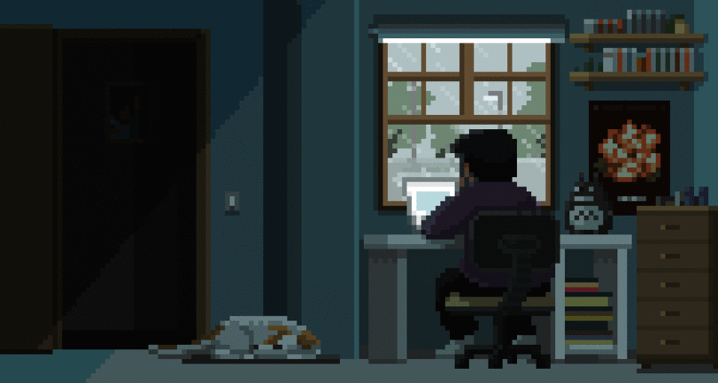

## Hi, I'm João Alves! 🤙

**About me:**

  Well, my name is João and I'm 20 years old. I entered the programming market at 15, with PHP7, HTML5 and CSS.

  I was recently introduced to the world of React JS and Ruby on Rails. There were many challenges and many projects in that time, and the greatest achievement for me is to feel the constant evolution, after all.

 **There 's always a next level ! 🚀**

### My Skills

<!-- 

  
<small>Github Stats :zap:</small>

  

     
    
     
     
   
    
  

-->

### Contact me

  
     

